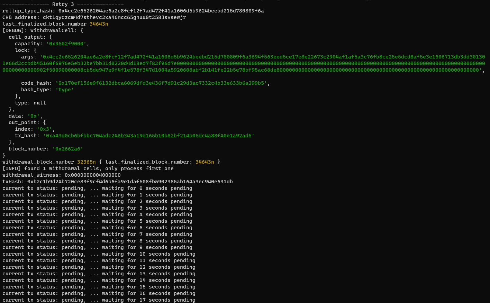
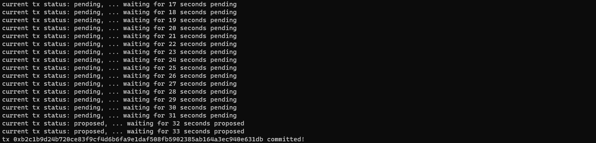

# Nervos Network Gitcoin Task 10

# A screenshot of the console output immediately after running the "unlock" command.

# The Ethereum address that you've used for your Layer 2 account (in text format).
0x7BfA8e68A5B660981028046Ac5a04706d075D083

# The Nervos Layer 1 address associated with the private key passed to "unlock" command (in text format). 
ckt1qyqzcm4d7sthevc2xa46mcc65gnuu0t2583svsewjr
