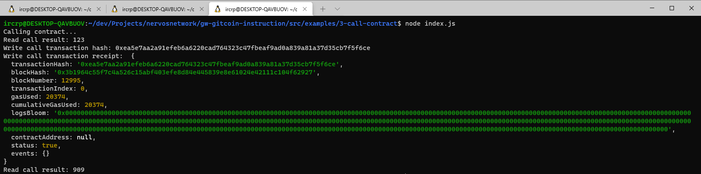

# Nervos Network Gitcoin Task 3

# A screenshot of the console output following successful call to the smart contract


# The transaction hash
```sh
0xea5e7aa2a91efeb6a6220cad764323c47fbeaf9ad0a839a81a37d35cb7f5f6ce
```

# The called smart contract address
```sh
0x880c27f875C4A00a7918953A668A1690BC8A76F2
```

# The ABI of called smart contract
```json
[
    {
      "inputs": [],
      "stateMutability": "payable",
      "type": "constructor"
    },
    {
      "inputs": [
        {
          "internalType": "uint256",
          "name": "x",
          "type": "uint256"
        }
      ],
      "name": "set",
      "outputs": [],
      "stateMutability": "payable",
      "type": "function"
    },
    {
      "inputs": [],
      "name": "get",
      "outputs": [
        {
          "internalType": "uint256",
          "name": "",
          "type": "uint256"
        }
      ],
      "stateMutability": "view",
      "type": "function"
    }
  ]
```