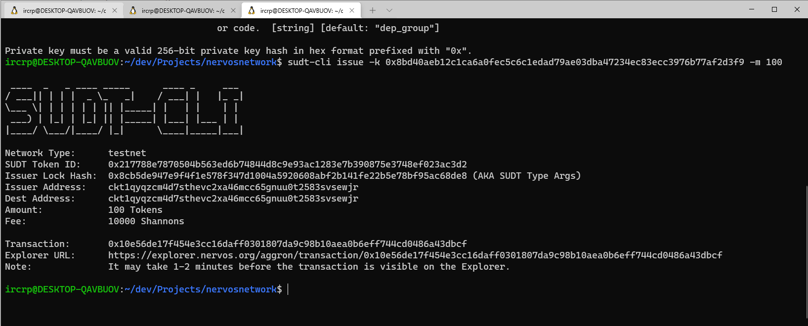
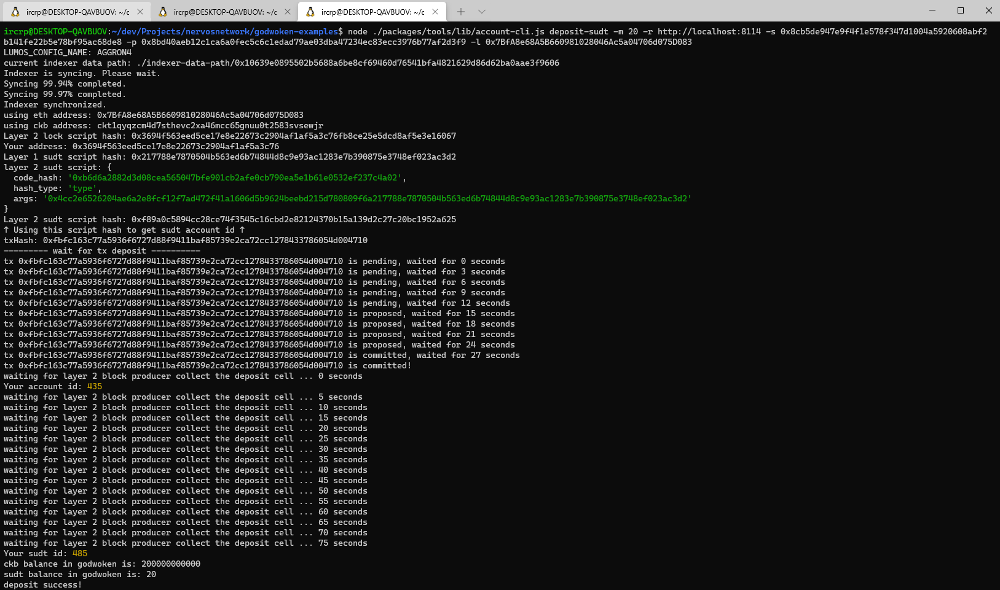

# Nervos Network Gitcoin Task 4

# Link to funded Layer 1 address
https://explorer.nervos.org/aggron/address/ckt1qyqzcm4d7sthevc2xa46mcc65gnuu0t2583svsewjr

# A screenshot of the console output following successful call to the smart contract


# Link to the transaction ID 
https://explorer.nervos.org/aggron/transaction/0x10e56de17f454e3cc16daff0301807da9c98b10aea0b6eff744cd0486a43dbcf

# A screenshot of the console output following successful submittion of a deposit of the token to Layer 2


# The SUDT ID from deposit call
```sh
485
```