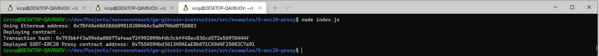
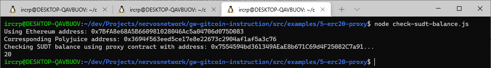

# Nervos Network Gitcoin Task 5

# A screenshot of the console output immediately after deploying smart contract.


# The address of the ERC20 Proxy Contract you deployed 
```sh
0x7554594bd361349AEaE8b671C69d4F25082C7a91
```

# A screenshot of the console output immediately after checking SUDT balance


# The Ethereum address that was checked
```sh
0x7BfA8e68A5B660981028046Ac5a04706d075D083
```