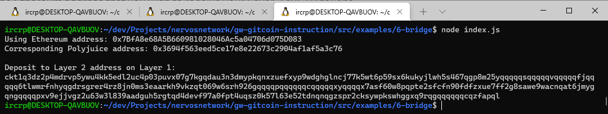

# Nervos Network Gitcoin Task 6

# A screenshot of the console output after successfully generating Deposit Receiver Address


# Deposit Receiver Address
```sh
ckt1q3dz2p4mdrvp5ywu4kk5edl2uc4p03puvx07g7kgqdau3n3dmypkqnxzuefxyp9wdghglncj77k5wt6p59sx6kukyjlwh5s467qgp8m25yqqqqqsqqqqqvqqqqqfjqqqqq6tlwmrfnhyqgdrsgrer4rz8jn0ms3eaarkh9vkzqt069w6srh926gqqqqpqqqqqqcqqqqqxyqqqqx7asf60w8pqpte2sfcfn90fdfzxue7ff2g8sawe9wacnqat6jmygqngqqqqpxv9ejjvgz2u63w3l839aadguh5rgtqd4devf97a0fpt4uqsz0k57l63e52tdnqnqgzspr2cksywpkswhggxq9rqgqqqqqqcqzfapql
```

# The Ethereum address used to generate the Deposit Receiver Address
```sh
0x7BfA8e68A5B660981028046Ac5a04706d075D083
```

# A link to the Etherscan explorer for the successful Force Bridge transaction
https://rinkeby.etherscan.io/tx/0xc5e4c507fe6dde7c0e63c516d11a75103aa7cad3ef8cf124bb2fc64859ea67cb

# A link to the Nervos explorer for the successful Force bridge transaction
https://explorer.nervos.org/aggron/transaction/0x8d01e313b77fa68b0ddc71565b76078218a41caf5b5520d55983d2ed84b1d7d8
