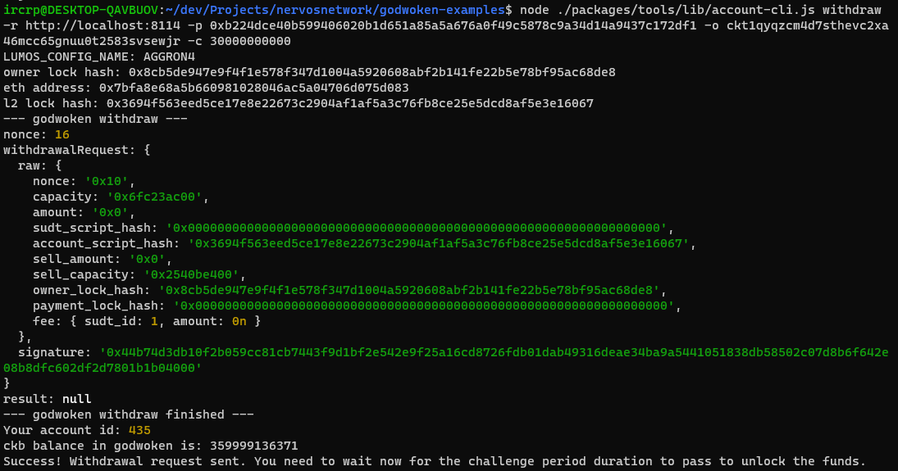

# Nervos Network Gitcoin Task 9

# A screenshot of the console output immediately after running the withdraw command

# The Ethereum address that you've used for Layer 2 account
0x7BfA8e68A5B660981028046Ac5a04706d075D083

# The Nervos Layer 1 address that was passed to withdraw command
ckt1qyqzcm4d7sthevc2xa46mcc65gnuu0t2583svsewjr
